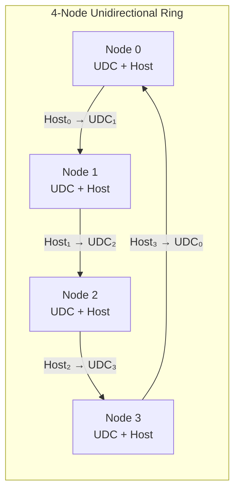
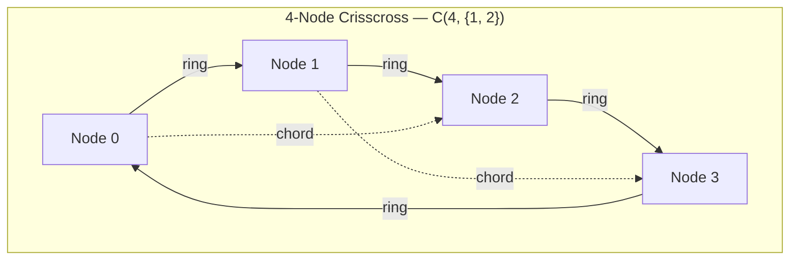
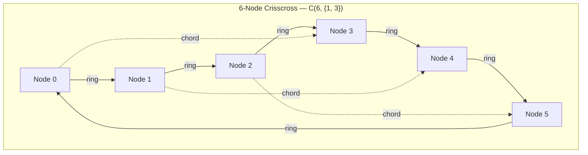
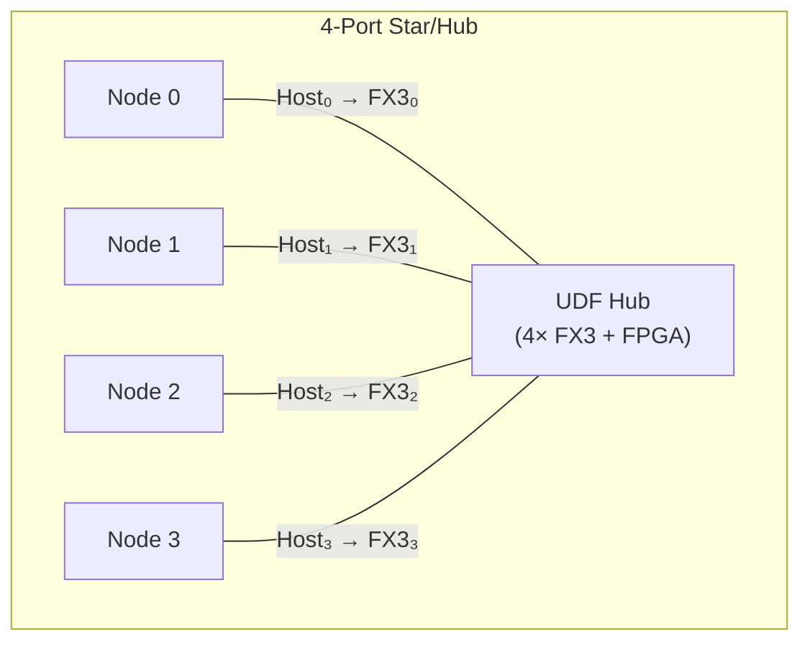
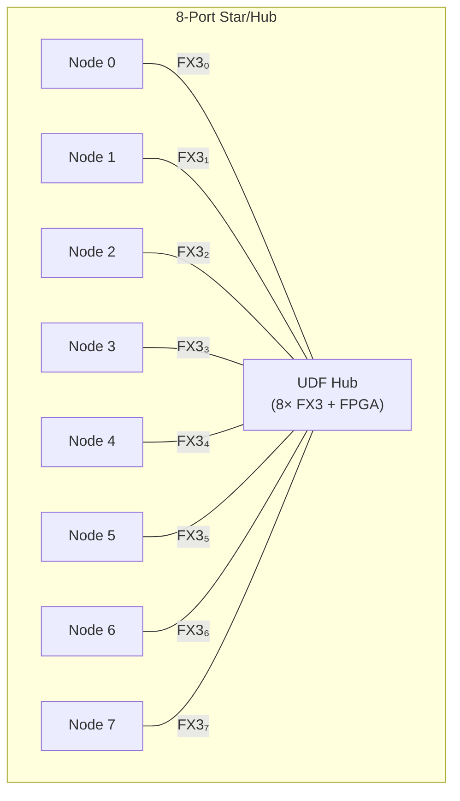
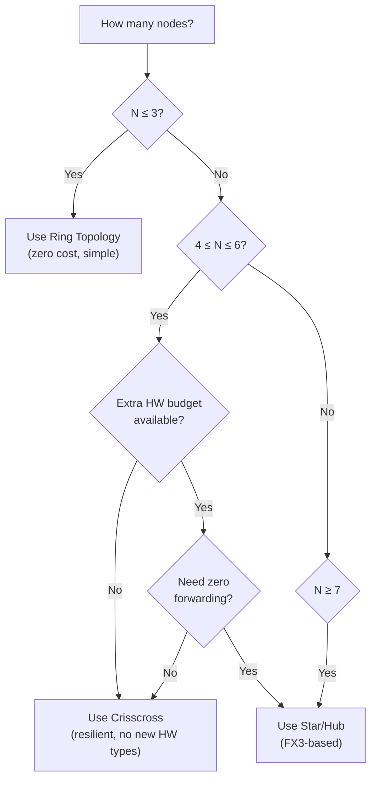

# USB Direct Fabric — Topology Specification

| Field   | Value      |
|---------|------------|
| Version | 0.1        |
| Date    | 2026-06-22 |
| Status  | Draft      |

---

## 1. Overview

UDF supports three physical topologies. Each topology makes different tradeoffs between resilience, performance, cost, and complexity. This document specifies the requirements, routing algorithms, failure modes, and performance characteristics of each.

### Key Terms

| Term | Definition |
|------|------------|
| Degree | USB connections per node. Each connection = 1 cable between a host port on one machine and a gadget port on another. |
| UDC | USB Device Controller — the gadget port on a machine capable of acting as a USB device. |
| Diameter | Maximum number of hops between any pair of nodes in the topology. |
| Edge connectivity | Minimum number of cables that must be cut to partition the network into two disconnected components. |
| Link speed | Raw USB bulk throughput: ~3.5 Gbps for USB3 Gen 1, ~7.2 Gbps for USB3 Gen 2. |

---

## 2. Ring Topology (Degree 2)

### 2.1 Physical Requirements

Each node requires:
- 1 UDC port (gadget/device side)
- 1 host port (xHCI side)

Nodes are cabled in a circle: **node\_i host → node\_{i+1 mod N} gadget**.

Every node acts simultaneously as a USB host (to its clockwise neighbor) and a USB device (to its counter-clockwise neighbor).

Minimum node count: N = 2 (point-to-point link, trivially a ring).

### 2.2 Routing Algorithm

**Unidirectional ring (1 UDC per node):** Frames travel clockwise. Each node inspects the `dst` field; if dst ≠ self, forward out the host port (clockwise).

**Bidirectional ring (2 UDC per node):** Forward via the shorter path (clockwise or counter-clockwise).

#### Pseudocode — Route Decision (Unidirectional)

```python
def route_frame(self_id, frame, N):
    if frame.dst == self_id:
        deliver_to_local(frame)
    else:
        forward_clockwise(frame)
```

#### Pseudocode — Route Decision (Bidirectional)

```python
def route_frame_bidir(self_id, frame, N):
    if frame.dst == self_id:
        deliver_to_local(frame)
        return

    clockwise_dist = (frame.dst - self_id) % N
    counter_clockwise_dist = (self_id - frame.dst) % N

    if clockwise_dist <= counter_clockwise_dist:
        forward_clockwise(frame)
    else:
        forward_counter_clockwise(frame)
```

### 2.3 Properties

| Property | Value |
|----------|-------|
| Cables | N |
| Diameter | ⌊N/2⌋ |
| Edge connectivity | 1 (unidirectional), 2 (dual-ring) |
| Bisection bandwidth | 2 × link\_speed |
| Forwarding overhead per hop | ~5% CPU |
| Latency per hop | < 50 µs (software forwarding) |

### 2.4 Failure Modes

- **Single cable failure:** Ring is partitioned. All nodes on one side of the break cannot reach nodes on the other side. No automatic recovery in unidirectional ring.
- **Single node failure:** Equivalent to two cable failures (both cables attached to that node are lost). Ring partitioned.
- **Recovery:** Not possible without dual-ring or manual re-cabling.

### 2.5 Dual-Ring Variant

A counter-rotating ring uses 2 UDC ports per node and 2 host ports per node (degree 4). Two independent rings carry traffic in opposite directions.

| Property | Dual-Ring |
|----------|-----------|
| Cables | 2N |
| UDC per node | 2 |
| Host ports per node | 2 |
| Edge connectivity | 2 |
| Survives 1 cable failure | Yes (wrap-around at break point) |
| Survives 1 node failure | Yes (both rings wrap) |

On failure detection, adjacent nodes "wrap" traffic from one ring to the other at the break point, forming a single long ring from the two broken rings.

### 2.6 Diagram — 4-Node Ring



### 2.7 Scaling Table

| N | Cables | Diameter | Edge Connectivity | Bisection BW (USB3.0) | Max Aggregate BW |
|---|--------|----------|-------------------|-----------------------|------------------|
| 2 | 2 | 1 | 1 | 7.0 Gbps | 7.0 Gbps |
| 3 | 3 | 1 | 1 | 7.0 Gbps | 10.5 Gbps |
| 4 | 4 | 2 | 1 | 7.0 Gbps | 14.0 Gbps |
| 6 | 6 | 3 | 1 | 7.0 Gbps | 21.0 Gbps |
| 8 | 8 | 4 | 1 | 7.0 Gbps | 28.0 Gbps |

---

## 3. Crisscross Topology (Degree 3)

### 3.1 Physical Requirements

Each node requires one of:
- **Option A (commodity hardware):** 1 UDC port + 2 host ports
- **Option B (RK3588-class):** 2 UDC ports + 1 host port

Nodes first form a ring (as in §2), then add chord links that skip across the ring to reduce diameter.

### 3.2 Chord Selection Algorithm

For N nodes numbered 0..N−1 arranged in a ring:

1. Maintain the ring edges: node\_i → node\_{(i+1) mod N} for all i.
2. Add chord edges: node\_i → node\_{(i + ⌊N/2⌋) mod N} for all i.

This produces the **circulant graph C(N, {1, ⌊N/2⌋})**.

For odd N, use chord length ⌊N/2⌋ (resulting in N chord edges). For even N, each chord is shared between two nodes (node\_i's chord to node\_{i+N/2} is the same edge as node\_{i+N/2}'s chord to node\_i), yielding N/2 unique chord cables.

### 3.3 Routing Algorithm

Precomputed shortest-path routing using Dijkstra on the static circulant graph. Each node stores a next-hop table indexed by destination.

On link failure: remove failed edge from graph, recompute shortest paths, distribute updated tables.

#### Pseudocode — Routing Table Construction

```python
def build_routing_table(self_id, N, failed_edges=set()):
    """Build next-hop table for this node using BFS/Dijkstra."""
    # Construct adjacency for circulant C(N, {1, floor(N/2)})
    adj = defaultdict(set)
    for i in range(N):
        for step in [1, N // 2]:
            neighbor = (i + step) % N
            edge = (min(i, neighbor), max(i, neighbor))
            if edge not in failed_edges:
                adj[i].add(neighbor)
                adj[neighbor].add(i)

    # BFS from self_id
    next_hop = {}
    visited = {self_id}
    queue = deque()

    for neighbor in adj[self_id]:
        queue.append((neighbor, neighbor))  # (node, first_hop)
        visited.add(neighbor)
        next_hop[neighbor] = neighbor

    while queue:
        node, first = queue.popleft()
        for neighbor in adj[node]:
            if neighbor not in visited:
                visited.add(neighbor)
                next_hop[neighbor] = first
                queue.append((neighbor, first))

    return next_hop
```

#### Pseudocode — Forwarding

```python
def route_frame(self_id, frame, routing_table):
    if frame.dst == self_id:
        deliver_to_local(frame)
    elif frame.dst in routing_table:
        forward_to(routing_table[frame.dst], frame)
    else:
        drop(frame)  # unreachable destination
```

### 3.4 Properties

| Property | Value |
|----------|-------|
| Cables | N + N/2 (even N) |
| Diameter | ⌈N/4⌉ (even N) |
| Edge connectivity | 2 |
| Bisection bandwidth | 3 × link\_speed (minimum) |
| Forwarding overhead per hop | ~5% CPU |

### 3.5 Gadget Port Bottleneck

With a single UDC per node, all inbound traffic to that node must traverse a single USB device link. This limits inbound throughput to 1 × link\_speed regardless of the number of sources.

**When this matters:**
- Many-to-one traffic patterns (e.g., distributed compute aggregating results to one node)
- Node acting as a storage server receiving writes from multiple peers

**Mitigation with 2 UDC (RK3588-class):**
- Inbound capacity doubles to 2 × link\_speed
- Two neighbors connect as host to this node's two gadget ports
- Routing table assigns inbound traffic across both UDC ports for load balancing

**Analysis:** For N ≤ 6 with uniform traffic, the single-UDC bottleneck is rarely hit because diameter is small (1-2 hops) and traffic is distributed. For skewed workloads (one hot destination), the 2-UDC variant provides meaningful relief.

### 3.6 Failure Modes

| Failure | Impact | Recovery |
|---------|--------|----------|
| 1 cable failure | Network stays connected. Alternate path exists via remaining ring + chords. Diameter may increase by 1. | Automatic: recompute routing tables. |
| 2 cable failures | May partition if both cuts isolate a node from all neighbors. For well-distributed cuts, network remains connected with degraded diameter. | Recompute; if partitioned, no recovery without re-cabling. |
| 1 node failure | Neighbors lose 1-2 connections each. Remaining nodes stay connected (for N ≥ 4). | Recompute routing excluding failed node. |

### 3.7 Recovery Procedure

1. **Detection:** Heartbeat timeout — each node sends HELLO frames every 200 ms to each neighbor. If no HELLO received within 500 ms, link declared down.
2. **Notification:** Node detecting failure broadcasts a TOPO\_CHANGE frame (flooded to all nodes) containing the failed edge.
3. **Recomputation:** Each node removes the failed edge from its local graph model and recomputes its routing table (BFS, < 1 ms for N ≤ 16).
4. **Convergence:** Within 1 round-trip of the topology (diameter × hop\_latency ≈ 2 × 50 µs = 100 µs for 4-node). Total recovery time dominated by detection: ~500 ms.
5. **Restoration:** When a failed link comes back, the reconnecting node sends HELLO; neighbor broadcasts TOPO\_RESTORE. Tables recomputed to include restored edge.

### 3.8 Diagrams

#### 4-Node Crisscross



#### 6-Node Crisscross



### 3.9 Scaling Table

| N | Ring Cables | Chord Cables | Total Cables | Diameter | Edge Connectivity | Bisection BW (USB3.0) |
|---|-------------|--------------|--------------|----------|-------------------|-----------------------|
| 4 | 4 | 2 | 6 | 1 | 2 | 10.5 Gbps |
| 5 | 5 | 5 | 10 | 2 | 2 | 10.5 Gbps |
| 6 | 6 | 3 | 9 | 2 | 2 | 10.5 Gbps |
| 8 | 8 | 4 | 12 | 2 | 2 | 14.0 Gbps |
| 10 | 10 | 5 | 15 | 3 | 2 | 14.0 Gbps |
| 12 | 12 | 6 | 18 | 3 | 2 | 17.5 Gbps |

---

## 4. Star/Hub Topology (FX3-Based)

### 4.1 Physical Requirements

**Endpoint nodes:** Each requires only 1 UDC port (no host port needed for fabric — host port connects to hub). Actually, endpoint nodes need 1 **host** port to connect to the hub's FX3 device port. Endpoints do zero forwarding.

**Central hub:** Contains N × Cypress FX3 (CYUSB3014) USB3 device controllers, each connected via GPIF-II (32-bit, 100 MHz = 3.2 Gbps) to a shared FPGA backplane that performs frame switching.

### 4.2 Hub Architecture

```
┌─────────────────────────────────────────────────────────┐
│                    UDF Hub (PCB)                         │
│                                                         │
│  ┌──────┐  ┌──────┐  ┌──────┐       ┌──────┐          │
│  │ FX3  │  │ FX3  │  │ FX3  │  ...  │ FX3  │          │
│  │ #0   │  │ #1   │  │ #2   │       │ #N-1 │          │
│  └──┬───┘  └──┬───┘  └──┬───┘       └──┬───┘          │
│     │GPIF     │GPIF     │GPIF          │GPIF           │
│  ┌──┴─────────┴─────────┴──────────────┴───┐           │
│  │         FPGA Backplane (ECP5)            │           │
│  │   - Frame parser (reads dst field)       │           │
│  │   - Crossbar switch (N×N)                │           │
│  │   - Broadcast replicator                 │           │
│  │   - Port ↔ node_id mapping table         │           │
│  └──────────────────────────────────────────┘           │
└─────────────────────────────────────────────────────────┘
      │USB3       │USB3       │USB3            │USB3
      ▼           ▼           ▼                ▼
   Node 0      Node 1      Node 2          Node N-1
  (host port) (host port) (host port)     (host port)
```

Each FX3 chip presents a USB3 SuperSpeed device endpoint to one node's host controller. The node sees a standard USB bulk device (UDF gadget class). Frames received by an FX3 chip are passed via GPIF-II to the FPGA, which reads the destination field and routes the frame to the appropriate output FX3 chip.

### 4.3 Routing

The hub maintains a switching table mapping `node_id → FX3_port_index`. This table is populated at link-up when each endpoint sends an initial HELLO frame containing its node\_id.

| Operation | Behavior |
|-----------|----------|
| Unicast | Hub reads `dst` field, looks up output port, forwards frame to that FX3 chip |
| Broadcast | Hub replicates frame to all FX3 ports except the ingress port |
| Unknown dst | Drop frame, increment error counter |

Endpoints perform **zero forwarding**. All routing intelligence lives in the hub FPGA.

### 4.4 Properties

| Property | Value |
|----------|-------|
| Cables | N (one per endpoint to hub) |
| Diameter | 2 (src → hub → dst) |
| Edge connectivity | 1 per endpoint (hub port failure isolates that node) |
| Hub failure | Total network failure (SPOF) |
| Forwarding at endpoints | None |
| Latency | 2 × USB transfer latency + FPGA switching (~1 µs) |

### 4.5 Cost Model

| Component | Unit Cost | Quantity (4-port hub) | Subtotal |
|-----------|-----------|----------------------|----------|
| CYUSB3014 (BGA-121) | ~€18 | 4 | €72 |
| Lattice ECP5-25F (FPGA) | ~€35 | 1 | €35 |
| Custom PCB (4-layer, BGA assembly) | ~€300 | 1 | €300 |
| Passives, connectors, voltage regulators | ~€30 | 1 | €30 |
| **Total (prototype)** | | | **€437** |

| Scale | Per-Unit Cost |
|-------|---------------|
| Prototype (1 unit) | €250–400 |
| Small batch (10 units) | €150–200 |
| Production (100+ units) | €80–120 |

### 4.6 Bandwidth

Each port independently delivers full link\_speed to/from the hub:
- USB3 Gen 1: 3.5 Gbps per port
- USB3 Gen 2: 7.2 Gbps per port

**Hub backplane requirements:**

| Design | Backplane Throughput | Behavior |
|--------|---------------------|----------|
| Non-blocking | N × link\_speed | All ports at full speed simultaneously |
| Blocking (2:1 oversubscription) | N/2 × link\_speed | Acceptable for bursty traffic patterns |

GPIF-II per FX3 delivers 3.2 Gbps (32-bit @ 100 MHz). This is the bottleneck for USB3 Gen 2 links (7.2 Gbps > 3.2 Gbps). **Mitigation:** Use dual GPIF-II threads per FX3 (supported by CYUSB3014) to achieve 6.4 Gbps, or accept Gen 1 speed at the backplane crossing.

### 4.7 Failure Modes

| Failure | Impact | Recovery |
|---------|--------|----------|
| Single endpoint cable failure | That endpoint is isolated. All other endpoints unaffected. | Reconnect cable; endpoint sends HELLO on link-up. |
| Single FX3 chip failure | Same as cable failure for that port. | Hardware replacement required. |
| FPGA failure | Total network down (SPOF). | Hardware replacement or redundant hub. |
| Hub power failure | Total network down. | Restore power; all endpoints reconnect. |

### 4.8 Diagrams

#### 4-Port Star



#### 8-Port Star



---

## 5. Comparison

### 5.1 Summary Table

| Property | Ring (deg 2) | Crisscross (deg 3) | Star/Hub (FX3) |
|----------|--------------|---------------------|----------------|
| Cables (4 nodes) | 4 | 6 | 4 (+hub) |
| Cables (8 nodes) | 8 | 12 | 8 (+hub) |
| Diameter (4 nodes) | 2 | 1 | 2 |
| Diameter (8 nodes) | 4 | 2 | 2 |
| Edge connectivity | 1 | 2 | 1 (per node) |
| Survives 1 cable failure | No | Yes | Yes (not hub cable) |
| Extra hardware cost | €0 | €0 (commodity) / €80/node (RK3588) | €250–400 (hub) |
| Gadget ports per node | 1 | 1–2 | 1 |
| Host ports per node | 1 | 2 (Option A) / 1 (Option B) | 1 |
| Forwarding CPU per node | ~5% per hop | ~5% per hop | 0% (hub does it) |
| Max aggregate BW (4×USB3.0) | 14 Gbps | 21 Gbps | 14 Gbps |
| Worst-case latency (4 nodes) | 100 µs | 50 µs | 100 µs |
| Best for N= | 2–3 | 4–6 | 7+ |

### 5.2 Decision Flowchart



---

## 6. Recommendations

1. **Start with Ring** for proof-of-concept deployments (2–3 nodes). Zero additional hardware cost, minimal software complexity, validates the UDF protocol stack end-to-end.

2. **Graduate to Crisscross** when adding the 4th node. Provides single-cable-failure resilience with no new hardware types beyond commodity USB host ports. The circulant graph structure halves diameter compared to ring at the same node count.

3. **Consider Star/Hub only for 7+ nodes** or when forwarding latency/CPU overhead at intermediate nodes is unacceptable. The hub eliminates all endpoint forwarding at the cost of a custom PCB (€250–400 prototype).

4. **Dual-Ring as alternative to Crisscross** if all nodes have dual-UDC capability (e.g., all RK3588-class SoCs). Provides the same failure resilience as crisscross but with simpler routing (no shortest-path computation — just wrap on failure).

---

## 7. References

1. **UDF Wire Format Specification v0.1** — `spec/udf-wire-format-v0.1.md`
2. **USB 3.2 Specification** — USB Implementers Forum, Rev 1.1, September 2022
3. **Circulant Graph Theory** — Boesch & Tindell, "Circulants and their connectivities," *Journal of Graph Theory*, 1984
4. **Cypress FX3 Technical Reference Manual** — CYUSB3014, Infineon Document No. 001-76078
5. **Lattice ECP5 Family Data Sheet** — FPDS-02003, Lattice Semiconductor, 2020
6. **UDF Protocol Specification v1.0** — `spec/udf-protocol-v1.0.md`
