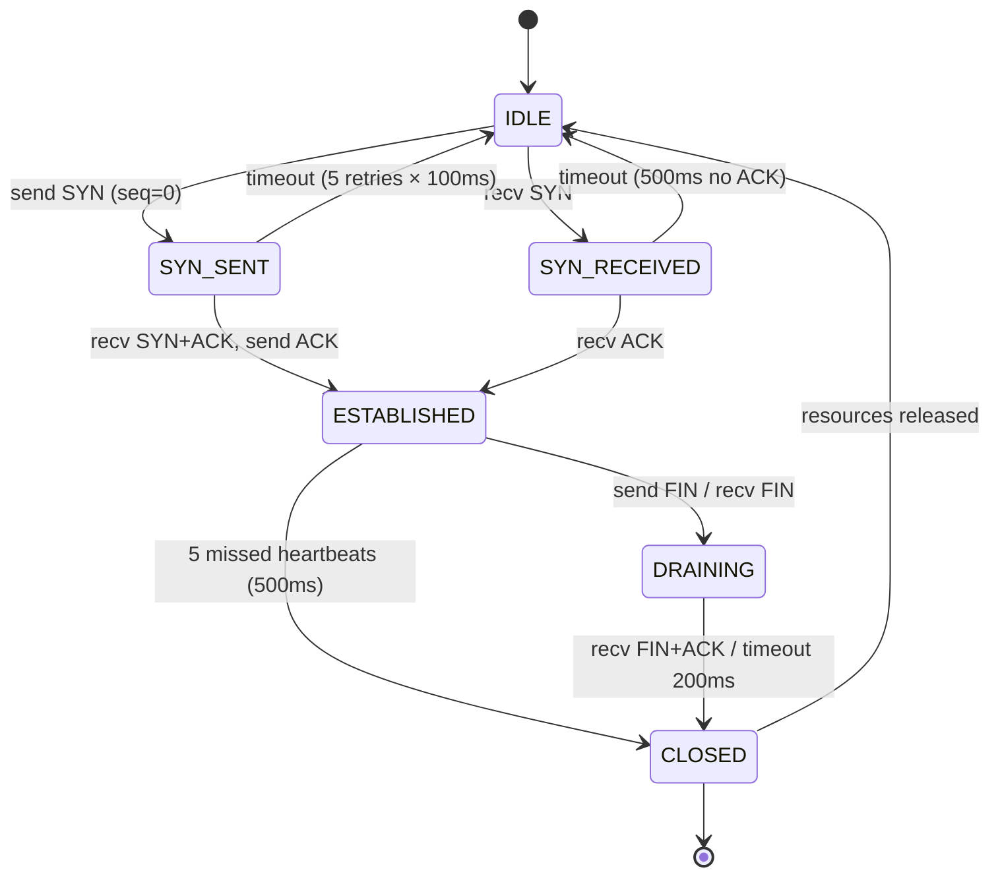

# USB Direct Fabric — Wire Format Specification

| Field    | Value                |
|----------|----------------------|
| Version  | 0.1                  |
| Date     | 2026-06-22           |
| Status   | Draft                |
| Authors  | UDF Project          |

---

## 1. Overview

The USB Direct Fabric (UDF) wire format defines a native USB bulk transport protocol that bypasses fixed ethernet rate ceilings (1/2.5/5/10 GbE steps) by operating directly over USB bulk endpoints. This allows the transport to fill the USB pipe elastically — achieving ~3.5 Gbps on USB3 Gen 1 or ~7.2 Gbps on Gen 2 — with no custom host drivers required.

### Design Goals

- **Zero-copy friendly**: Frame header and payload are naturally aligned; payload starts at offset 16, suitable for DMA and page-aligned buffer schemes.
- **USB3 burst-aligned**: Maximum frame size fits within a single USB3 max burst (16 × 1024 = 16384 bytes), minimizing transaction overhead.
- **Minimal overhead**: 16 bytes of header + 4 bytes CRC = 20 bytes fixed overhead per frame.
- **Forwarding support**: Hop count and source/destination routing fields enable store-and-forward in ring and crisscross topologies without re-encapsulation.
- **No dependencies**: Pure bulk transfers — no isochronous scheduling, no interrupt endpoints, no vendor-specific host drivers.

---

## 2. Frame Format

### Frame Structure (ASCII Art)

```
 0                   1                   2                   3
 0 1 2 3 4 5 6 7 8 9 0 1 2 3 4 5 6 7 8 9 0 1 2 3 4 5 6 7 8 9 0 1
+-+-+-+-+-+-+-+-+-+-+-+-+-+-+-+-+-+-+-+-+-+-+-+-+-+-+-+-+-+-+-+-+
|         Magic (0x5546)        |    Flags      |   Hop Count   |  ← Header
+-+-+-+-+-+-+-+-+-+-+-+-+-+-+-+-+-+-+-+-+-+-+-+-+-+-+-+-+-+-+-+-+
|                       Sequence Number                         |
+-+-+-+-+-+-+-+-+-+-+-+-+-+-+-+-+-+-+-+-+-+-+-+-+-+-+-+-+-+-+-+-+
|   Source ID   |    Dest ID    |        Payload Length         |  ← Routing
+-+-+-+-+-+-+-+-+-+-+-+-+-+-+-+-+-+-+-+-+-+-+-+-+-+-+-+-+-+-+-+-+
|                     Reserved (must be 0)                      |
+-+-+-+-+-+-+-+-+-+-+-+-+-+-+-+-+-+-+-+-+-+-+-+-+-+-+-+-+-+-+-+-+
|                                                               |
|                   Payload (0–16368 bytes)                      |
|              (padded to 16-byte alignment)                    |
|                                                               |
+-+-+-+-+-+-+-+-+-+-+-+-+-+-+-+-+-+-+-+-+-+-+-+-+-+-+-+-+-+-+-+-+
|                        CRC-32                                 |  ← Trailer
+-+-+-+-+-+-+-+-+-+-+-+-+-+-+-+-+-+-+-+-+-+-+-+-+-+-+-+-+-+-+-+-+
```

### Byte Layout (Linear)

```
Offset  Size   Field
──────  ────   ─────────────────────────
 0      2      Magic (0x55, 0x46 = 'UF')
 2      1      Flags
 3      1      Hop Count
 4      4      Sequence Number (little-endian)
 8      1      Source Node ID
 9      1      Destination Node ID
10      2      Payload Length (little-endian)
12      4      Reserved (0x00000000)
16      0–16368  Payload (padded to 16B boundary)
16+N    4      CRC-32 (little-endian)
```

### Size Constraints

| Metric | Value | Derivation |
|--------|-------|------------|
| Maximum frame size | 16388 bytes | 16 (header+routing) + 16368 (payload) + 4 (CRC) |
| Minimum frame size | 20 bytes | 16 (header+routing) + 0 (payload) + 4 (CRC) |
| USB3 burst capacity | 16384 bytes | 16 × 1024 (wMaxPacketSize × bMaxBurst+1) |
| Payload alignment | 16 bytes | Payload is zero-padded to next 16-byte boundary |

> **Note**: The maximum frame size of 16388 bytes exceeds a single burst by 4 bytes (the trailing CRC). Implementations MUST account for this by either including the CRC in the final burst packet or issuing a short final transfer of 4 bytes. The 16368-byte payload limit ensures the header + payload fits within one burst; only the CRC spills.

---

## 3. Field Definitions

| Field | Offset | Size (bytes) | Type | Description | Valid Values |
|-------|--------|--------------|------|-------------|--------------|
| Magic | 0 | 2 | uint16 BE | Protocol identifier. Fixed value `0x5546` (ASCII 'UF'). | `0x5546` only |
| Flags | 2 | 1 | uint8 | Bitfield controlling frame semantics. See §4. | See §4 |
| Hop Count | 3 | 1 | uint8 | Number of forwarding hops traversed. Originator sets to 0; each forwarder increments by 1. | 0–15 (drop if >15) |
| Sequence Number | 4 | 4 | uint32 LE | Per-link-direction monotonic counter. See §5. | 0–4294967295 |
| Source Node ID | 8 | 1 | uint8 | Originating node identifier. | 0x01–0xFE (0x00=unassigned, 0xFF=broadcast) |
| Destination Node ID | 9 | 1 | uint8 | Target node identifier. `0xFF` = broadcast to all reachable nodes. | 0x01–0xFE, 0xFF=broadcast |
| Payload Length | 10 | 2 | uint16 LE | Actual payload byte count before padding. | 0–16368 |
| Reserved | 12 | 4 | uint32 | Must be set to zero by sender. Receiver MUST ignore. Future: credit-based flow control. | `0x00000000` |
| Payload | 16 | 0–16368 | bytes | Application data. Padded with zeros to next 16-byte boundary. | Arbitrary octets |
| CRC-32 | 16+padded_len | 4 | uint32 LE | IEEE 802.3 CRC-32 computed over all preceding bytes (header + routing + padded payload). | Computed value |

### Padding Calculation

```
padded_payload_size = (payload_length + 15) & ~15    if payload_length > 0
padded_payload_size = 0                              if payload_length == 0
total_frame_size    = 16 + padded_payload_size + 4
```

---

## 4. Flags Byte

| Bit | Mask | Name | Description |
|-----|------|------|-------------|
| 0 | `0x01` | SYN | Connection initiation. Resets sequence numbers to 0 on both sides. |
| 1 | `0x02` | FIN | Connection teardown. Sender enters DRAINING state. |
| 2 | `0x04` | ACK | Acknowledgment. Combined with SYN for handshake completion (SYN+ACK = `0x05`). |
| 3 | `0x08` | FWD | Frame has been forwarded by an intermediate node (not from originator). |
| 4 | `0x10` | HB | Heartbeat frame. Standard 20-byte format (zero payload + CRC). |
| 5 | `0x20` | CAP | Capabilities exchange frame. Payload contains negotiation data per §9. |
| 6 | `0x40` | — | Reserved. Must be 0. |
| 7 | `0x80` | — | Reserved. Must be 0. |

### Flag Combinations

| Combination | Flags Value | Meaning |
|-------------|-------------|---------|
| SYN | `0x01` | Initiate connection |
| SYN+ACK | `0x05` | Accept connection |
| ACK | `0x04` | Acknowledge SYN (handshake complete) |
| FIN | `0x02` | Initiate shutdown |
| FIN+ACK | `0x06` | Acknowledge shutdown |
| HB | `0x10` | Heartbeat (20-byte minimum frame) |
| CAP | `0x20` | Capabilities exchange |
| FWD | `0x08` | Set by forwarders (ORed with existing flags) |

---

## 5. Sequence Numbers

- **Type**: 32-bit unsigned integer, little-endian.
- **Scope**: Per link direction (each direction maintains its own independent counter).
- **Initial value**: 0 (reset on SYN handshake).
- **Increment**: +1 per transmitted frame on that link direction.
- **Wrap**: At `2^32 - 1`, wraps to 0. No special signaling — receiver tracks the expected next value and detects wrap implicitly.
- **Heartbeat frames**: Heartbeats DO consume a sequence number (they are sequenced).
- **Forwarded frames**: Retain the original sequence number from the originating link. The forwarding node's own link uses its own sequence space.

### Receiver Behavior

The receiver maintains `expected_seq`. On receipt:

1. If `frame.seq == expected_seq` → accept, increment `expected_seq`.
2. If `frame.seq > expected_seq` → gap detected, log warning, update `expected_seq = frame.seq + 1`, accept frame.
3. If `frame.seq < expected_seq` → duplicate or reorder, drop silently, increment duplicate counter.

---

## 6. Flow Control

### v0.1: NAK-Based (Hardware Native)

UDF v0.1 relies entirely on the USB hardware's native flow control mechanism:

1. The gadget-side (device controller) posts bulk OUT receive buffers.
2. When all buffers are consumed (gadget is busy), the UDC hardware returns **NAK** to the host's bulk OUT transfer.
3. The host controller retries per the USB 3.x specification (hardware-level, transparent to software).
4. Once the gadget posts new buffers, the next host retry succeeds.

This provides back-pressure with zero software overhead and zero additional protocol messages.

### No Software Flow Control in v0.1

- No window advertisements.
- No credit-based schemes.
- No PAUSE frames.

### Future (v0.2+)

The 4-byte Reserved field (offset 12–15) is designated for future credit-based window flow control. A proposed scheme:

- Sender includes remaining TX credits in Reserved[0:1] (uint16 LE).
- Receiver grants credits via ACK frames with credit count in Reserved[0:1].

This is NOT implemented in v0.1. The Reserved field MUST be zero.

---

## 7. Connection State Machine

### States

| State | Description |
|-------|-------------|
| IDLE | No connection. Waiting to initiate or receive SYN. |
| SYN_SENT | SYN transmitted, awaiting SYN+ACK. |
| SYN_RECEIVED | SYN received, SYN+ACK transmitted, awaiting ACK. |
| ESTABLISHED | Handshake complete. Data transfer active. Heartbeats flowing. |
| DRAINING | FIN sent or received. Completing in-flight frames. |
| CLOSED | Connection terminated. Resources released. Return to IDLE. |

### State Diagram



### Handshake Sequence

```
Initiator                          Responder
─────────                          ─────────
    │                                  │
    │──── SYN (seq=0) ───────────────→ │
    │                                  │  → enters SYN_RECEIVED
    │←─── SYN+ACK (seq=0) ────────────│
    │                                  │
    │──── ACK (seq=1) ───────────────→ │  → enters ESTABLISHED
    │  → enters ESTABLISHED            │
    │                                  │
    │←──→ CAP exchange ←──→            │  (both sides send CAP frame)
    │                                  │
    │←──→ DATA / HB ←──→              │
```

### Timeout Values

| Parameter | Value | Description |
|-----------|-------|-------------|
| SYN retry interval | 100 ms | Time between SYN retransmissions |
| SYN max retries | 5 | Total attempts before declaring failure |
| Heartbeat interval | 100 ms | Time between HB frame transmissions |
| Dead detection threshold | 500 ms | 5 consecutive missed heartbeats |
| DRAINING timeout | 200 ms | Max time in DRAINING before forced CLOSED |

---

## 8. USB Descriptors

### Device Descriptor

| Field | Value | Notes |
|-------|-------|-------|
| bLength | 18 | |
| bDescriptorType | 0x01 | DEVICE |
| bcdUSB | 0x0310 | USB 3.1 |
| bDeviceClass | 0xFF | Vendor-specific |
| bDeviceSubClass | 0x00 | |
| bDeviceProtocol | 0x00 | |
| bMaxPacketSize0 | 9 | 2^9 = 512 bytes (USB3 control EP) |
| idVendor | 0x1d6b | Linux Foundation |
| idProduct | 0x0105 | UDF gadget |
| bcdDevice | 0x0001 | v0.1 |
| iManufacturer | 1 | String index |
| iProduct | 2 | String index |
| iSerialNumber | 3 | String index |
| bNumConfigurations | 1 | |

### Configuration Descriptor

| Field | Value | Notes |
|-------|-------|-------|
| bLength | 9 | |
| bDescriptorType | 0x02 | CONFIGURATION |
| wTotalLength | 44 | Config + Interface + 2 EP + SS Companion × 2 |
| bNumInterfaces | 1 | |
| bConfigurationValue | 1 | |
| iConfiguration | 0 | No string |
| bmAttributes | 0xC0 | Self-powered |
| bMaxPower | 0 | Self-powered, no bus power draw |

### Interface Descriptor

| Field | Value | Notes |
|-------|-------|-------|
| bLength | 9 | |
| bDescriptorType | 0x04 | INTERFACE |
| bInterfaceNumber | 0 | |
| bAlternateSetting | 0 | |
| bNumEndpoints | 2 | IN + OUT |
| bInterfaceClass | 0xFF | Vendor-specific |
| bInterfaceSubClass | 0x01 | UDF |
| bInterfaceProtocol | 0x01 | UDF Wire Format v0.1 |
| iInterface | 0 | |

### Endpoint Descriptors

#### Bulk OUT Endpoint

| Field | Value | Notes |
|-------|-------|-------|
| bLength | 7 | |
| bDescriptorType | 0x05 | ENDPOINT |
| bEndpointAddress | 0x01 | EP1 OUT |
| bmAttributes | 0x02 | Bulk |
| wMaxPacketSize | 1024 | USB3 bulk max |
| bInterval | 0 | |

#### SuperSpeed Endpoint Companion (OUT)

| Field | Value | Notes |
|-------|-------|-------|
| bLength | 6 | |
| bDescriptorType | 0x30 | SS_EP_COMPANION |
| bMaxBurst | 15 | 16 packets per burst (0-indexed) |
| bmAttributes | 0x00 | No streams |
| wBytesPerInterval | 0 | Bulk: not applicable |

#### Bulk IN Endpoint

| Field | Value | Notes |
|-------|-------|-------|
| bLength | 7 | |
| bDescriptorType | 0x05 | ENDPOINT |
| bEndpointAddress | 0x81 | EP1 IN |
| bmAttributes | 0x02 | Bulk |
| wMaxPacketSize | 1024 | USB3 bulk max |
| bInterval | 0 | |

#### SuperSpeed Endpoint Companion (IN)

| Field | Value | Notes |
|-------|-------|-------|
| bLength | 6 | |
| bDescriptorType | 0x30 | SS_EP_COMPANION |
| bMaxBurst | 15 | 16 packets per burst (0-indexed) |
| bmAttributes | 0x00 | No streams |
| wBytesPerInterval | 0 | Bulk: not applicable |

### String Descriptors

| Index | Value |
|-------|-------|
| 0 | Language: 0x0409 (English US) |
| 1 | `"Linux Foundation"` |
| 2 | `"USB Direct Fabric"` |
| 3 | `"{node_id_hex}-{random_suffix}"` (unique per device instance) |

---

## 9. Negotiation

After the SYN/SYN+ACK/ACK handshake completes (state = ESTABLISHED), both sides MUST exchange a CAP frame within 200ms. If no CAP frame is received within this window, the connection MUST be torn down with FIN.

### CAP Frame Payload Format

```
Offset  Size   Field
──────  ────   ─────────────────────────
 0      2      Protocol Version (uint16 LE) — 0x0001 for v0.1
 2      2      Max Frame Size (uint16 LE) — advertised maximum
 4      1      Node ID (uint8)
 5      1      Features Bitmap (uint8)
 6      10     Node Name (UTF-8, null-padded)
```

Total CAP payload: **16 bytes** (naturally aligned, no padding needed).

### Features Bitmap

| Bit | Mask | Feature |
|-----|------|---------|
| 0 | `0x01` | Forwarding capable |
| 1 | `0x02` | CRC offload available |
| 2 | `0x04` | Multi-link (node has >1 UDF interface) |
| 3–7 | — | Reserved (must be 0) |

### Negotiation Rules

- Both sides send CAP independently (no request/response — both transmit after entering ESTABLISHED).
- If `protocol_version` fields are incompatible, the higher-version side MUST downgrade or FIN.
- The effective max frame size for the link is `min(local_max, remote_max)`.
- Node IDs MUST be unique within a topology. Conflict → FIN with error logged.

---

## 10. Heartbeat Protocol

### Frame Format (Shortened)

Heartbeat frames use the standard 20-byte minimum frame format (full header + CRC, zero payload). This ensures uniform transfer sizes at the USB bulk endpoint boundary, preventing short-packet synchronization issues in asynchronous URB submission queues.

A heartbeat is a normal UDF frame with:
- Flags = `0x10` (HB bit set)
- Source = sender's node ID
- Destination = `0x00` (ignored by receiver)
- Payload Length = 0
- CRC-32 computed over the 16-byte header as usual

**Total: 20 bytes (16B header + 4B CRC). No payload.**

> **Design rationale**: An earlier draft used a shortened 8-byte format without CRC.
> This was rejected because: (1) variable-size transfers (8B vs 16KB) can thrash
> asynchronous URB pools in userspace implementations; (2) without CRC, a corrupted
> data frame could be misidentified as a heartbeat; (3) the bandwidth cost difference
> between 8 and 20 bytes at 5 Gbps is completely negligible (~0.00003%).

### Behavior

- **Sender**: Transmit one HB frame every 100ms when no data frame has been sent within that interval. If a data frame was sent within the interval, the heartbeat MAY be suppressed (data frames prove liveness).
- **Receiver**: Maintain a `last_seen` timestamp updated on receipt of ANY valid frame (data or HB).
- **Dead detection**: If `now - last_seen > 500ms` (5 intervals), declare link dead and transition to CLOSED.

### Heartbeat During Handshake

- No heartbeats are sent during SYN_SENT or SYN_RECEIVED states.
- Heartbeat transmission begins immediately upon entering ESTABLISHED.

---

## 11. Error Handling

| Condition | Action | Counter |
|-----------|--------|---------|
| CRC-32 mismatch | Drop frame silently | `crc_errors` |
| Magic bytes invalid | Drop frame silently | `sync_errors` |
| Sequence gap (seq > expected) | Accept frame, log warning, update expected | `seq_gaps` |
| Sequence duplicate (seq < expected) | Drop frame silently | `seq_duplicates` |
| Hop count > 15 | Drop frame, do not forward | `ttl_exceeded` |
| Payload length > 16368 | Drop frame silently | `oversize_errors` |
| Reserved field non-zero | Accept frame (forward-compatible), log warning | `reserved_nonzero` |
| Unknown flags (bits 6–7 set) | Accept frame, ignore unknown bits | — |
| CAP timeout (>200ms after ESTABLISHED) | Send FIN, close connection | `cap_timeouts` |

### Counter Reporting

All error counters are unsigned 64-bit integers, monotonically increasing, never reset (wrap at 2^64). Implementations SHOULD expose counters via a local management interface (sysfs, proc, or Unix socket).

### No Retransmission

UDF v0.1 does NOT perform retransmission at the transport layer. Reliability is delegated to upper layers. The rationale:

1. USB bulk transfers are already reliable at the link layer (CRC16 per packet + retry in hardware).
2. Frame-level CRC-32 detects corruption from software bugs or buffer overruns, not cable errors.
3. Retransmission adds complexity and buffering incompatible with zero-copy goals.

---

## 12. Security Considerations

### v0.1: Physical Security Model

UDF v0.1 provides **no encryption, authentication, or integrity protection** beyond CRC-32 (which is not cryptographic). The security model relies entirely on the physical USB cable:

- USB cables are point-to-point, non-broadcast.
- An attacker requires physical access to the cable or one of the connected machines.
- This is equivalent to the threat model of a direct crossover Ethernet cable.

### Threats Not Addressed

| Threat | Mitigation in v0.1 |
|--------|---------------------|
| Eavesdropping | None (physical access required) |
| Frame injection | None (requires access to USB bus) |
| Replay attacks | Sequence numbers detect but do not prevent |
| Node impersonation | None (node ID is self-asserted) |

### Future Versions (v0.2+)

Future protocol versions MAY add:

- **Optional AEAD encryption**: AES-256-GCM or ChaCha20-Poly1305 applied to payload bytes. Key exchange during CAP phase using a pre-shared key or ECDH.
- **Node authentication**: Challenge-response during negotiation using per-node keys.
- **Encrypted mode flag**: A new flag bit (bit 6) indicating the payload is encrypted.

Encryption MUST be optional and negotiated during CAP exchange to preserve the zero-overhead path for trusted environments.

---

## 13. References

1. **USB 3.2 Specification, Revision 1.0** (June 2022). USB Implementers Forum. Chapters 8 (Protocol Layer) and 9 (Device Framework).

2. **Universal Serial Bus Communication Class — Network Control Model (CDC-NCM)**, Revision 1.0. USB-IF ECN. Referenced for comparison of framing approaches.

3. **IEEE 802.3-2022**, Section 3 — Frame Check Sequence. CRC-32 polynomial: `0x04C11DB7` (normal form), also known as CRC-32/ISO-HDLC. Computed over all frame bytes preceding the CRC field, transmitted in little-endian byte order.

4. **Linux kernel USB gadget subsystem** — `drivers/usb/gadget/`, FunctionFS (`f_fs`), ConfigFS composite framework. Implementation target for gadget-side UDF.

5. **DWC3 xDCI driver** — `drivers/usb/dwc3/`. Hardware UDC used on both sake (Gemini Lake) and beirao (Ice Lake) reference platforms.

---

*End of specification.*
